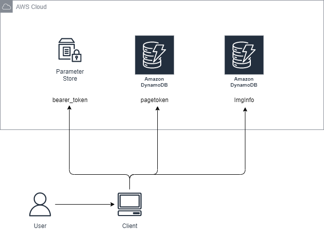

# FullScanLikedImg

特定のTwitterユーザーがいいねした画像を, すべて取得するシステム.


## Uses
- Python 3.7以上
- AWS
    - DynamoDB
    - パラメータストア
- boto3
- requests
- Twitter API


## Quick Start

1. 初期構築
    1. TwitterAPIを取得する
    1. DynamoDBを2つ作成する(pkeyのみ)
    1. パラメータストアにTwitterAPIのbearer_tokenをセットする
    1. DynamoDBに対しread/write権限, パラメータストアに対しread権限のあるロールを作成し, CLIが使えるようにする
1. このリポジトリをCloneする
    ```sh
    $ git clone https://github.com/tsuji-tomonori/FullScanLikedImg.git
    $ cd ./FullScanLikedImg
    ```
1. 必要なライブラリをインストール
    ```sh
    $ pip install -r requirements.txt
    ```
1. 環境変数の設定
    ```sh
    $ export BEARER_TOKEN="YOUR_BEARER_TOKEN_SSM_NAME_HERE"
    $ export LIKED_USER_ID="YOUR_LIKED_USER_ID_HERE"
    $ export PROPERTY_DB_NAME="YOUR_PROPERTY_DB_NAME_HERE"
    $ export PAGE_TOKE_DB_NAME="YOUR_PAGE_TOKE_DB_NAME_HERE"
    $ export DIR_NAME="YOUR_DIR_NAME_HERE"
    ```
1. ツールの実行
    ```sh
    $ python run.py
    ```


## Documentation

### アーキテクチャー図



### フローチャート図
[フローチャート図](./doc/main_flow.md)