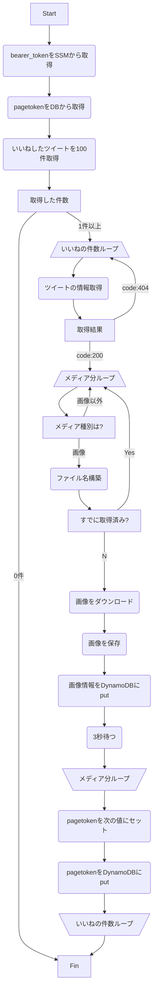

```mermaid
flowchart TD
    Start-->GetBearerToken(bearer_tokenをSSMから取得)
    GetBearerToken-->GetPageToken(pagetokenをDBから取得)
    GetPageToken--> GetLikedTweets(いいねしたツイートを100件取得)
    GetLikedTweets-->NumGetLikedTweets[取得した件数]
    NumGetLikedTweets--0件-->Fin
    NumGetLikedTweets--1件以上-->LoopStartLikes[/いいねの件数ループ\]
    LoopStartLikes-->GetStatusesShow(ツイートの情報取得)
    GetStatusesShow-->CodeGetStatusesShow[取得結果]
    CodeGetStatusesShow--code:404-->LoopStartLikes
    CodeGetStatusesShow--code:200-->LoopStartMedias[/メディア分ループ\]
    LoopStartMedias-->IfMediaType[メディア種別は?]
    IfMediaType--画像以外-->LoopStartMedias
    IfMediaType--画像-->BuildFileName(ファイル名構築)
    BuildFileName-->HasPropertyItem[すでに取得済み?]
    HasPropertyItem--Yes-->LoopStartMedias
    HasPropertyItem--No-->DownloadImg(画像をダウンロード)
    DownloadImg-->WriteImg(画像を保存)
    WriteImg-->PutProperty(画像情報をDynamoDBにput)
    PutProperty-->Wait3(3秒待つ)
    Wait3-->LoopEndMedias[\メディア分ループ/]
    LoopEndMedias-->SetPageToken(pagetokenを次の値にセット)
    SetPageToken-->PutPageToken(pagetokenをDynamoDBにput)
    PutPageToken-->LoopEndLikes[\いいねの件数ループ/]
    LoopEndLikes-->Fin
```